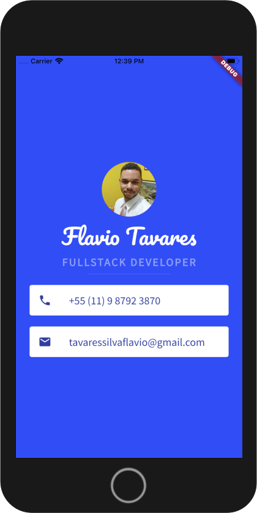

# mi_card_flutter

A project for presentation.

## Getting Started

This project is a simply visit card containing a profile picture, the phone number and the email adress.

**Thank you for the visit**.
